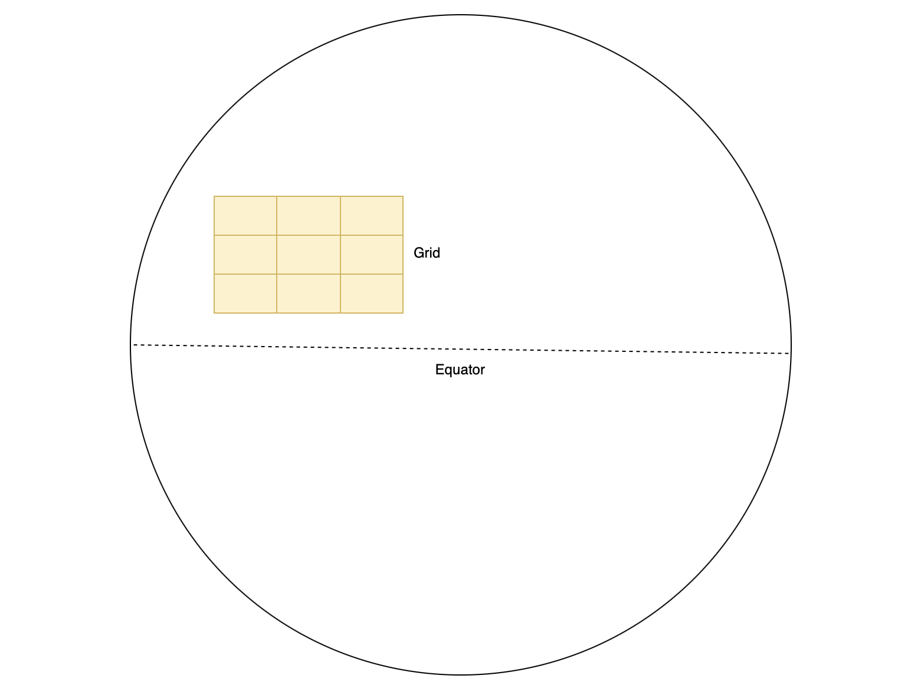

# PaLMTool
A trajectory is a trace generated by a moving object within a certain spatial-temporal context and is generally represented by a series of chronologically ordered points[^1]. While trajectory data plays an important role in domains like traffic analysis, public transportation management and wildlife monitoring, accurate and complete data are usually hard to obtain due to various factors, such as weak GPS signal in certain area or low sampling rate. 

There are various ways to generate realistic trajectory data, with PaLMTo[^1] being an efficient novel approach proposed in 2024 that adopts simple probalistic language models. This project is built upon previous research work[^2] by Mario A. Nascimento and Hayat Sultan Mohammed, aiming to provide a self-contained offline tool that allows users to upload sample trajectory data and generate new realistic trajectories.

## Glossary
**Cell Size**: side length of a square cell within a grid overlay in a geographical region where trajectories are recorded. When modeling a trajectory as a sentence, we need a way to uniquely identify each loaction indicated by a coordinate pair, which in our case invovles assigning a cell id to any location within that cell.

|  |  |
|:---:|:---:|
| *Earth representation* | *Cell size visualization* |

**Number of Generated Trajectories**: total number of synthetic trajectories to be generated with PaLMTo. Theoretically, this value can be any natural number. 

**Generation Method**: how synthetic trajectories should be generated using PaLMTo model. This field can only be set to one of two values: point-to-point and length-constrained. Point-to-point approach involves filling in the gap between pre-selected origin and destination points, while length-constrained method creates a trajectory by iteratively adding points to the origin until a predefined length is achieved. Refer to [^2] for a detailed explanation. 

**Trajectory Length**: length of each trajectory generated with length-constrained method. This value controls how many location points a synthetic trajectory should contain. 

[^1]: Mohammed, Hayat & Nascimento, Mario & Barbosa, Denilson. (2024). Effective Trajectory Imputation using Simple Probabilistic Language Models. 51-60. 10.1109/MDM61037.2024.00027. 
[^2]: Mohammed, Hayat & Nascimento, Mario. (2024). Realistic Trajectory Generation using Simple Probabilistic Language Models. 21-24. 10.1145/3681770.3698572. 
