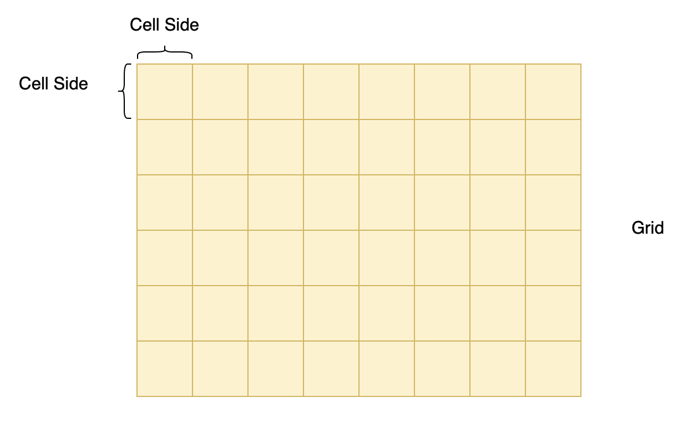

# WebPaLMTo
A spatial trajectory is a trace generated by a moving object within a certain spatial-temporal context and is generally represented by a series of chronologically ordered points. While trajectory data plays an important role in domains like traffic analysis, public transportation management and wildlife monitoring, accurate and complete data are usually hard to obtain due to various factors, such as weak GPS signal in certain area or low sampling rate as well as privacy concerns. 

PaLMTo[^1] uses simple probalistic language models in order to complete missing parts of a trajectory. In [^2] the authors presented an approach, based on PaLMTo for generating arbitrarily large and realistic trajectories based on a given trajectory dataset. This project presents WebPaLMTo, a web-based stand-alone web-based implementation application of the approach presented in [^2].

The main idea behind the trajectory generation is to (1) tesselate the trajectory space, (2) assign unique identifiers to each partition on the tesselated space and (3) substitute each trajectory point within a partition by the partition's identifier. Once that is done, the trajectories will no longer be a set of finely granulated observations, e.g., GPS points, but rather be a sentence in the space of grid identifiers. That allows to learn a probabilistic model, as simple as N-grams, that can be used for various NLP-like tasks, such as sentence completion, but for trajectories. 

## Glossary
**Cell Side**: side length of a square cell within a grid overlay in a geographical region where trajectories are recorded. When modeling a trajectory as a sentence, we need a way to uniquely identify each loaction indicated by a coordinate pair, which in our case invovles assigning a cell id to any location within that cell. 

Note that value of this field applies to generated trajectories only. Value of the same parameter in creating a matching heatmap, which defaults to 200, can be found in [geo_process](PaLMTo_App/trajectory/geo_process.py).

|  |  |
|:---:|:---:|
| *Earth representation* | *Cell side visualization* |

**Number of Generated Trajectories**: total number of synthetic trajectories to be generated with PaLMTo. Theoretically, this value can be any natural number. 

**Generation Method**: how synthetic trajectories should be generated using PaLMTo model. This field can only be set to one of two values: point-to-point and length-constrained. Point-to-point approach involves filling in the gap between pre-selected origin and destination points, while length-constrained method creates a trajectory by iteratively adding points to the origin until a predefined length is achieved. Refer to [^2] for a detailed explanation. 

**Trajectory Length**: length of each trajectory generated with length-constrained method. This value controls how many location points a synthetic trajectory should contain. 

[^1]: Mohammed, Hayat & Nascimento, Mario & Barbosa, Denilson. (2024). Effective Trajectory Imputation using Simple Probabilistic Language Models. 51-60. 10.1109/MDM61037.2024.00027. 
[^2]: Mohammed, Hayat & Nascimento, Mario. (2024). Realistic Trajectory Generation using Simple Probabilistic Language Models. 21-24. 10.1145/3681770.3698572. 
